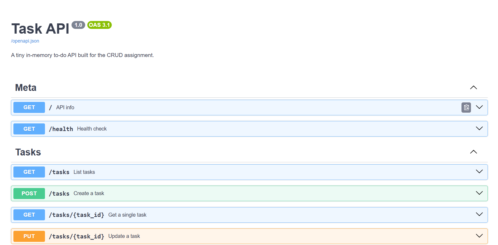
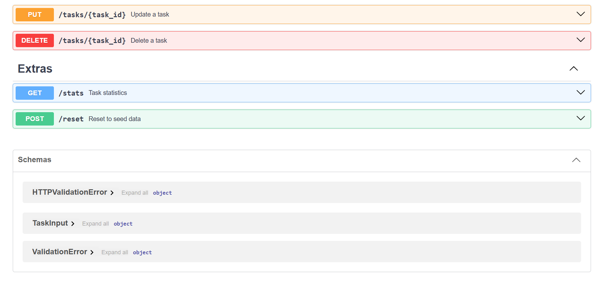

# Task API

A small in-memory CRUD API for managing a to-do list, built with **Python + FastAPI**.
Built for FlyRank Internship — Backend Track — W2 · A1.

## What this is

A tiny backend that lets a client **C**reate, **R**ead, **U**pdate, and **D**elete tasks.
Data lives only in memory (a Python list) — it resets every time the server restarts. No database yet.

## How to install & run

```bash
# 1. clone this repo, then cd into it
cd task-api

# 2. create a virtual environment (recommended)
python3 -m venv .venv
source .venv/bin/activate      # on Windows: .venv\Scripts\activate

# 3. install dependencies
pip install -r requirements.txt

# 4. run the server
uvicorn main:app --reload
```

The server starts on **http://localhost:8000**.

## Endpoints

| CRUD op | Method | Path             | Description                              | Success | Error codes |
|---------|--------|------------------|-------------------------------------------|---------|-------------|
| —       | GET    | `/`              | API info                                  | 200     | —           |
| —       | GET    | `/health`        | Health check                              | 200     | —           |
| Read    | GET    | `/tasks`         | List all tasks (supports `?done=`, `?search=`, `?limit=`, `?offset=`) | 200 | — |
| Read    | GET    | `/tasks/{id}`    | Get one task                              | 200     | 404         |
| Create  | POST   | `/tasks`         | Create a task (`{"title": "..."}`)        | 201     | 400         |
| Update  | PUT    | `/tasks/{id}`    | Update a task's title and/or done         | 200     | 400, 404    |
| Delete  | DELETE | `/tasks/{id}`    | Delete a task                             | 204     | 404         |
| Extra   | GET    | `/stats`         | `{ total, done, open }` counts            | 200     | —           |
| Extra   | POST   | `/reset`         | Restore the 3 example tasks               | 200     | —           |

## Swagger UI

Interactive docs (built into FastAPI, zero setup) live at:

**http://localhost:8000/docs**

Every endpoint above is listed there with a "Try it out" button.

## Testing it — example curl commands

```bash
# root + health
curl -i http://localhost:8000/
curl -i http://localhost:8000/health

# read
curl -i http://localhost:8000/tasks
curl -i http://localhost:8000/tasks/1
curl -i http://localhost:8000/tasks/99          # -> 404

# create
curl -i -X POST http://localhost:8000/tasks \
  -H "Content-Type: application/json" \
  -d '{"title":"Buy milk"}'                     # -> 201

curl -i -X POST http://localhost:8000/tasks \
  -H "Content-Type: application/json" \
  -d '{}'                                       # -> 400

# update
curl -i -X PUT http://localhost:8000/tasks/1 \
  -H "Content-Type: application/json" \
  -d '{"done": true}'                           # -> 200

# delete
curl -i -X DELETE http://localhost:8000/tasks/1 # -> 204
curl -i -X DELETE http://localhost:8000/tasks/1 # -> 404 (already gone)
```

<!--
  ⬇️ PASTE YOUR OWN curl -i OUTPUT HERE BEFORE SUBMITTING ⬇️
  Run one of the commands above against your running server and paste the
  real terminal output (with status code + headers visible) below.
-->

### Sample curl -i output

```
C:\Users\Ayesha Awan\OneDrive\Documents\task-api>curl -i http://localhost:8000/tasks
HTTP/1.1 200 OK
date: Wed, 19 Aug 2026 18:01:26 GMT
server: uvicorn
content-length: 131
content-type: application/json

[{"id":1,"title":"Buy milk","done":false},{"id":2,"title":"Walk the dog","done":false},{"id":3,"title":"Write README","done":true}]
```

## Swagger screenshot

<!-- ⬇️ Take a screenshot of /docs with the CRUD cycle working, save it as
     swagger-screenshot.png in this folder, and reference it below. -->




## The mortality experiment

<!--
  Do this yourself: create a few tasks, restart the server (Ctrl+C, then
  `uvicorn main:app --reload` again), then GET /tasks. Write 2 sentences
  about what happened and why.
-->

I created a test task, restarted the server, and checked /tasks again — the test task was gone, only the original 3 seed tasks remained. This happens because tasks are stored only in a Python list in memory, which resets every time the program restarts; nothing is saved to disk.

## AI vs me

<!--
  This section is intentionally left for you to complete honestly — the
  assignment explicitly asks you to write your OWN prompt from memory
  (without copying from the assignment doc), generate a second version in
  ai-version/, run both, diff them, and reflect. That comparison is only
  useful if the prompt and the reflection are genuinely yours.
-->

**My prompt:**

```
Build a small backend API in Python using FastAPI that manages a to-do list.
Each task should have: id (number), title (text), done (true/false).

I need these endpoints:
- GET / — shows basic info about the API
- GET /health — returns {"status": "ok"}
- GET /tasks — list all tasks
- GET /tasks/{id} — get one task, return 404 if not found
- POST /tasks — create a task, title is required, return 400 if title is missing or empty, return 201 on success
- PUT /tasks/{id} — update a task's title and/or done status, return 404 if not found, 400 if body is invalid
- DELETE /tasks/{id} — delete a task, return 204 on success, 404 if not found

Use in-memory storage only (a Python list), no database.
Include Swagger UI docs automatically (FastAPI gives this for free at /docs).
Pre-fill the list with 3 example tasks when the server starts.
```

**What the AI did better:**
Nothing major — it built all the same endpoints, used the same status codes for success, and Swagger docs worked automatically just like mine.
**What it got wrong or ignored:**
For errors, it returned {"detail": "..."} instead of {"error": "..."}. I asked for a 400/404 error but didn't specify the exact JSON key name, so it used FastAPI's default "detail" key instead of "error". It also didn't strip extra whitespace from titles the way my version does.
**What my prompt forgot to specify:**
I never told it what the error JSON should look like exactly (key name "error"), or that titles should have whitespace trimmed. It filled those gaps in with its own defaults.
**After the rematch, what changed:**
I added "return errors as {\"error\": \"message\"}" to my prompt, and on the second try it matched my format correctly.